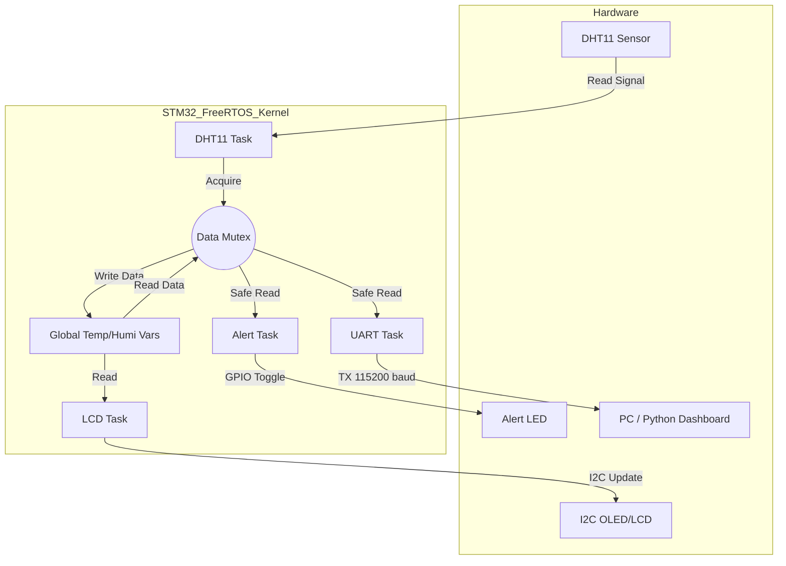

# Real-Time Environment Monitoring System with FreeRTOS on STM32


## Project Overview
This project implements a **real-time multitasking environmental monitoring system** using the **STM32F407VG** microcontroller and **FreeRTOS**. It reads temperature and humidity data from a **DHT11 sensor**, displays it on a local **I2C LCD**, and transmits data via **UART** to a PC/Python dashboard for remote monitoring.

Key technical features include **priority-based task scheduling**, **resource management using Mutexes**, and **cross-platform data visualization**.

---

## System Architecture

The system is designed with a modular task-based architecture to ensure concurrency and data integrity.



---

## Hardware Setup

| Component | STM32 Pin | Protocol | Description |
| :--- | :--- | :--- | :--- |
| **DHT11 Sensor** | `PA1` | GPIO (1-Wire) | Temperature & Humidity Input |
| **Alert LED** | `PD14` | GPIO Output | High Temp/Humi Warning Indicator |
| **LCD Display** | `PB6` (SCL), `PB9` (SDA)* | I2C1 | 16x2 Character LCD or SSD1306 |
| **PC / Bluetooth**| `PA2` (TX), `PA3` (RX) | USART2 | 115200 baud rate data transmission |

*> Note: I2C pins may vary based on specific board wiring, default I2C1 used.*

---

## Software Design (Firmware)

The firmware is built on **STM32CubeHAL** and **FreeRTOS**. The application logic is divided into four independent tasks:

### 1. DHT11 Sensor Task (`DHT11Task`)
* **Priority:** High
* **Function:** Handles precise timing for the DHT11 1-wire protocol.
* **Error Handling:** Implements automatic reset logic if sensor reading fails consecutively (e.g., pulling GPIO high/low to reset bus).
* **Synchronization:** Uses `xSemaphoreTake(xDataMutex)` before updating global variables to prevent race conditions.

### 2. UART Communication Task (`UARTTask`)
* **Function:** Formats sensor data into a string (`Temp:xx C, Humi:xx%`) and transmits it via USART2.
* **Thread Safety:** Acquires the Mutex to ensure it transmits the most recent valid data snapshot.

### 3. Display Task (`LCDTask`)
* **Function:** Updates the local LCD display.
* **Logic:** Refreshes the screen every 1 second to show current readings.

### 4. Alert Logic Task (`AlertTask`)
* **Function:** Monitors safety thresholds (Temp > 30°C or Humi > 70%).
* **Action:** Toggles the Red LED (`PD14`) immediately when unsafe conditions are detected.

---

## PC Dashboard (Python/PyQt5)

A custom Python GUI application was developed to visualize the incoming UART stream.

* **Libraries:** `PyQt5`, `pyserial`
* **Features:**
    * Auto-detection of serial data stream.
    * Real-time parsing of `Temp` and `Humi` values.
    * **Visual Alarms:** The UI displays a warning message and changes color when thresholds are exceeded, mirroring the embedded LED logic.

---

## Getting Started

### Firmware (STM32)
1.  Open the project in **STM32CubeIDE**.
2.  Ensure the pin configuration matches your hardware setup in `main.h`.
3.  Build and Flash the code to the STM32F407VG board.

### Python Dashboard
1.  Install dependencies:
    ```bash
    pip install PyQt5 pyserial
    ```
2.  Connect the STM32 to PC via USB-TTL (or USB cable if Virtual COM is enabled).
3.  Modify `COM_PORT` in `pyqt.py` to match your system (e.g., `COM8` or `/dev/ttyUSB0`).
4.  Run the script:
    ```bash
    python pyqt.py
    ```

---
